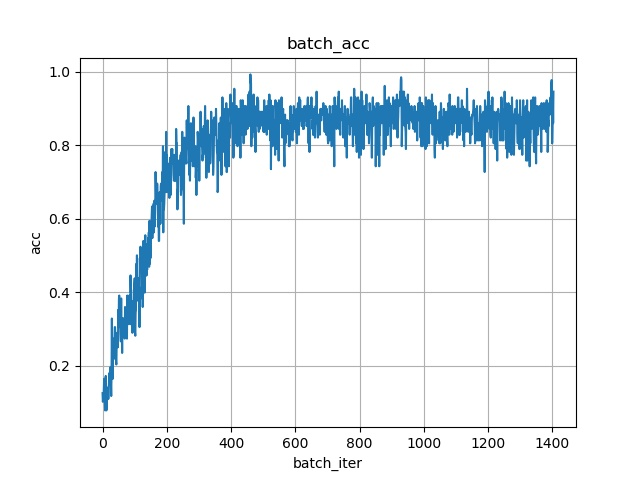

# 使用NumPy实现CNN（以MNIST为例）

## 要求

使用Python语言，不使用深度学习库，在MNIST或CIFAR-10数据集上训练一个5层的神经网络。包括全连接层，最大池化层。使用ReLU作为其激活函数。

## 分析

考虑到MNIST数据集规模较小，故选用MNIST作为数据集。

使用NumPy作为矩阵运算的库。将常见的功能封装为一个类，方便调用。

在CPU上运行比较慢，所以优先采用较小的卷积核。权重参数初始化方式为Kaiming He提出的方法。

我设计出的CNN架构如下：（图像输入尺寸：(28, 28, 1)）

（卷积层或全连接层才算一层，池化层不算）

| 层数 |    层的名称     |            层的参数            |
| :--: | :-------------: | :----------------------------: |
|  1   | **卷积层conv1** | 3*3卷积核，步长1，卷积核数量5  |
|  1   |    激活函数     |              ReLU              |
|  1   |      池化       |          Max Pooling           |
|  2   | **卷积层conv2** | 3*3卷积核，步长2，卷积核数量10 |
|  2   |    激活函数     |              ReLU              |
|  3   | **卷积层conv3** | 1*1卷积核，步长1，卷积核数量10 |
|  3   |    激活函数     |              ReLU              |
|  3   |      池化       |          Max Pooling           |
|  4   | **全连接层fc4** |          30个输出结点          |
|  4   |    激活函数     |              ReLU              |
|  5   | **全连接层fc5** |          10个输出结点          |
|  5   |      分类       |            softmax             |

## 代码设计

### 组织结构

使用`.forward()`函数作为正向传播，使用`.backward()`函数作为反向传播求梯度，使用`.update()`函数作为更新权重参数的方法。

我设计了5种封装的层：`Conv2D`、`FullyConnect`、`MaxPooling`、`ReLU,`、`Softmax`

以及1种模型类：Model_5LayersCNN（封装了上述的CNN架构）

5种层分别对应于5个`.py`文件，并封装为一个叫`npnet`的库，方便使用。

### 细节设计

以全连接层`FullyConnect`为例，说明一般的层是如何构建的。

#### __init__初始化
```python
def __init__(self, shape, output_num=2):
    '''初始化FC层'''
    self.input_shape = shape
    self.batchsize = shape[0]

    # 相当于Flatten操作，input_len是第二维及其以后的乘积（参数量）
    input_len = int(reduce(lambda x, y: x * y, shape[1:]))

    # 参数初始化（He初始化）
    self.weights = np.random.standard_normal(
        (input_len, output_num)) * math.sqrt(2 / input_len)
    self.bias = np.zeros(output_num)

    self.output_shape = [self.batchsize, output_num]
    self.w_gradient = np.zeros(self.weights.shape)
    self.b_gradient = np.zeros(self.bias.shape)
```

#### forward前向传播
```python
def forward(self, x):
    '''正向传播'''
    self.x = x.reshape([self.batchsize, -1])  # Flatten
    # 线性加权传播（self.bias会自动扩充维度）
    output = np.dot(self.x, self.weights) + self.bias
    return output
```

#### backward反向传播
```python
def backward(self, eta):
    '''求loss对w、b和x的梯度（返回值是loss对x的梯度）'''
    # 计算出对参数的梯度，以在backward()中更新参数
    # 对每个样本
    for i in range(eta.shape[0]):
        col_x = self.x[i][:, np.newaxis]  # 输入值（列向量）
        eta_i = eta[i][:, np.newaxis].T  # dL/dy（转置后得到行向量）
        # 梯度累加
        # dL/dw = dy/dw * dL/dy = x * eta
        self.w_gradient += np.dot(col_x, eta_i)
        # dL/db = dL/dy * dy/db = eta * 1 = eta
        self.b_gradient += eta_i.reshape(self.b_gradient.shape)

    # 计算出loss对输入的导数
    # dL/dx = dL/dy * dy/dx = eta * w
    next_eta = np.dot(eta, self.weights.T)
    next_eta = np.reshape(next_eta, self.input_shape)
    return next_eta
```
#### update更新权重
```python
def update(self, alpha=0.00001, weight_decay=0.0004):
    '''更新参数'''
    # weight_decay：L2正则化
    self.weights *= (1 - weight_decay)
    self.bias *= (1 - weight_decay)
    # 梯度下降
    self.weights -= alpha * self.w_gradient
    self.bias -= alpha * self.bias
    # 清零
    self.w_gradient = np.zeros(self.weights.shape)
    self.b_gradient = np.zeros(self.bias.shape)
```
#### Model_5LayersCNN的设计

Model_5LayersCNN是模型类，封装了get_correct_num、cal_loss、forward、backward、update等方法。方便调用，避免写繁琐的代码。
其中forward是正向传播、backward是梯度反向传播、update是更新参数。

# 训练效果

CPU跑的有点慢，仅跑了3个epoch就花费了差不多1.5个小时。

一些参数设置：

> batch_size = 128  
> epoch_num = 3 
> learning_rate = 1e-4  
> weight_decay = 5e-4 

学习率采用每个epoch依次减少的方法，最后测试集精度86%。

模型结构是随便设置的，参数也是随便设置的，效果一般般。




# 代码

见附件，或者我的[代码仓库](https://github.com/Karbo123/npnet)

## 使用方法
1. `python train.py`训练模型
2. `python plot.py`绘制曲线图

## 文件说明
1. npnet文件夹：封装的功能层（我把它叫做npnet）
2. model.py：自建的CNN模型定义（可以在这里修改模型结构）
3. train.py：训练（可以在这里修改训练参数，如batch_size）
4. plot.py：画曲线图
5. plot.log：信息日志
